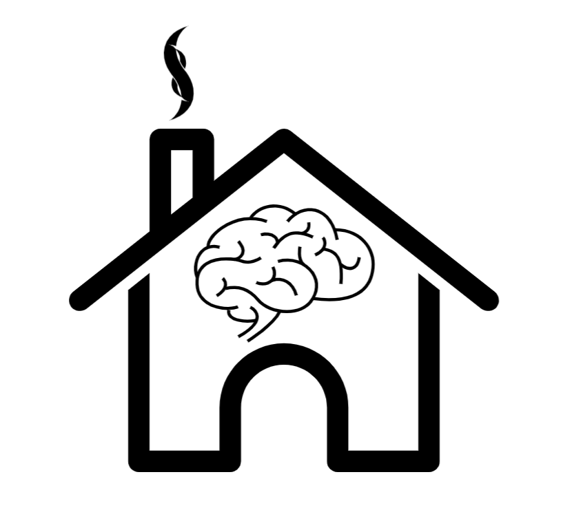

# Predictive Automation Using Home Assistant
> A integration for Home Assitant that track users and their smart device usage while they go about their daily lives within their home. Our integration will then use Machine Learning to automate tasks the user typically preforms by scheduling them within Home Assitant. 

## Table of contents
* [General info](#general-info)
* [Technologies](#technologies)
* [Features](#features)
* [Status](#status)
* [Retrospective](#retrospective)
* [Contact](#contact)

## General info
Our integration will help non-technical users tackle home automation. Home assistant has a tedious and diffucult to understand configuration processes for home automation. Our integration simplifies the configuration process to be as minimal as possible. Our integration will configure the scheduling of all smart devices in the home by tracking how the user normally utilizes them. The integration then builds and maintains predictive schedules for the devices.   

## Technologies
* [Home Assistant](https://www.home-assistant.io/) - version 0.98.5
* [Sci-kit Learn](https://scikit-learn.org/stable/) - version 0.21.2
* [Rasberry pi - Model 3](https://www.raspberrypi.org/products/raspberry-pi-3-model-b/) - Model B
* [Google Maps API](https://developers.google.com/maps/documentation/)

[//]: <> (## Setup)
[//]: <> (Describe how to install / setup your local environement / add link to demo version.)

[//]: <> (## Code Examples)
[//]: <> (Show examples of usage:)
[//]: <> (`put-your-code-here`)

## Features
List of features ready and TODOs for future development

* Improved Accuracy of Machine Learning Code and corrected output- Shaun
* Reworked Database and Management - Stavros
* Integrating Google API for presence detection and travel time - Sherwin
* Captured event triggers, and implemented machine learning output to Automation.yaml - Derek
* Implement History and Recorder plugins to log actions in Database - Patrick

To-do list:
* Fix Home Assistant Integration Environment
* Implement Automatic Triggering of all components
* Improve Panda Data Frame

## Status
Project is: _in progress_ As it is still not completely functional
* [Machine Learning Code Working, next step to integrate with plugin](https://github.com/CS3398-Bolians-Booleans/CS3398-Bolians-S2019/tree/master/machine%20learning) - Shaun
* Hardware SetUp Complete, Add Additional Devices to Smart Network,created Database(https://github.com/CS3398-Bolians-Booleans/CS3398-Bolians-S2019/tree/master/Database) - Stavros
* [Created a Flask server to get real-time data. Next step is to create a pipeline for our integration to get real-time data](https://github.com/CS3398-Bolians-Booleans/CS3398-Bolians-S2019/tree/master/Architecture%20and%20API) - Sherwin
* [Implemented Lovelace UI, Integrated Logger and History Plugins for action tracking and storage of this data in database](https://github.com/CS3398-Bolians-Booleans/CS3398-Bolians-S2019/blob/master/BasicPlugin%20-%20Scaffold) - Patrick
* [Logging complete, Next build out multiple user action tracking](https://github.com/CS3398-Bolians-Booleans/CS3398-Bolians-S2019/tree/master/user%20location) - Derek 

## Retrospective
What Went Well or Maybe Not:
* Still Attended Regulary Scheduled Meetings
* Maintained Frequent Communication
* All Code Compiles and Runs
* Keep bigger picture in mind when assigning tasks
* Assumed Tasks Would be Straight-Forward
  * Shaun - Achieved 95% accuracy on Machine Learning
  * Patrick - Accurate Device tracking 
  * Stavros - Database works well
  * Sherwin - Excellent Positivity
  * Derek - Action Scheduling went well
     

What Might Be Impeding Us from Performing Better:
* Lack of Familiarity and Experience With Home Assistant

What Can We do to Improve:
* Better endurance in meeting, and a higher understanding of Home Assistant Environment
  * Shaun - Be more adaptable to change
  * Patrick - Communicate lack of understanding at a more timely rate
  * Sherwin - Take more initiative in implementing my work with the teams work
  * Stavros - Be more insightful about planned work load
  * Derek - Communicate my understanding of Home Assistant better
  
  

[//]: <> (## Inspiration)
[//]: <> (Add here credits. Project inspired by..., based on...)

## Contact
Created by [@Bolians](https://github.com/CS3398-Bolians-Booleans) - feel free to contact us! 
* Email: spc51@txstate.edu
